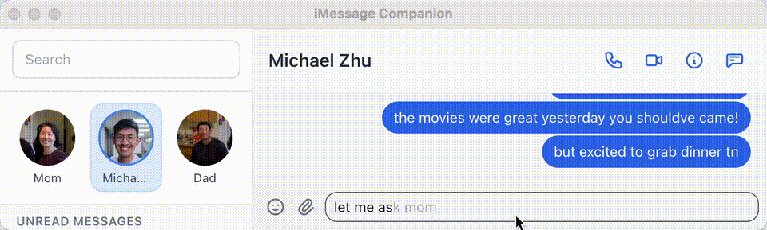

# myMessage

A macOS desktop client for iMessage. Includes all iMessage features and additional AI-enabled powers and shortcuts.



## Features

- **Tab to autocomplete**: AI suggests message completions and actions (send, call, switch chat) as you type
- **AI companion panel**: Ask questions about the conversation or get draft reply options
- **Contact context**: AI learns and remembers details about your contacts for personalized suggestions
- **Command palette**: Cmd+K to quickly jump to chats or run commands
- **Keyboard-first**: Cmd+1-9 for chat shortcuts, arrow navigation, pinned chats
- **Real-time sync**: Messages appear instantly via WebSocket

## Requirements

- macOS (Intel or Apple Silicon)
- Rust
- Node.js 18+

## Setup

```bash
# Backend
cd backend && cargo build --release

# Frontend
cd app && npm install
```

### Permissions

Grant Full Disk Access to your terminal (System Settings → Privacy & Security → Full Disk Access) to read the Messages database. Restart your terminal after.

## Run

```bash
# Terminal 1 — Backend
export OPENROUTER_API_KEY=your-api-key
cd backend && cargo run --release

# Terminal 2 — Frontend
cd app && npm run dev
```

Get an API key at [openrouter.ai](https://openrouter.ai).

## Tech Stack

**Backend:** Rust, Axum, Rusqlite  
**Frontend:** Electron, React, TypeScript, Tailwind CSS
